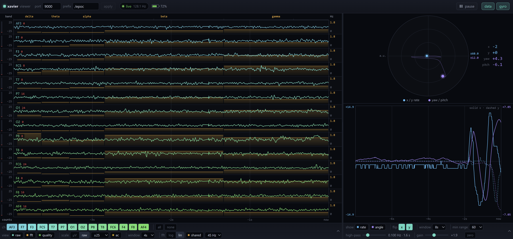

# xavier-tools

>[!IMPORTANT]
>This repository is fully AI-generated, based on instructions that were prompted, or described in the `planning.md` files.



Tools for the (discontinued) Emotiv EPOC EEG headset.

The first tool, `epoc`, reads all 14 EEG channels in real time from the
headset's USB receiver dongle and displays them live in the terminal: raw
counts, microvolts, peak-to-peak amplitude, per-channel power in the five
standard EEG bands, plus contact quality, gyro and battery. It can also
stream samples, band powers, contact quality, gyro and battery out over OSC.

This is a port of [emokit](https://github.com/openyou/emokit) to modern,
cross-platform C++17 with a standard CMake build. See
[Relationship to emokit](#relationship-to-emokit) for what changed and why.

## Status

| | |
|---|---|
| Windows (MSVC 2022, x64) | Working — verified end to end against real hardware |
| Linux | Build hooks in place, **not yet tested** |
| macOS | Build hooks in place, **not yet tested** |

Decryption, channel decode and gyro are confirmed correct against a real
headset and dongle. The band-power analysis is verified by unit tests against
analytically known signals, but has not been cross-checked against a reference
EEG implementation.

## Requirements

- **CMake** 3.16 or newer
- A **C++17** compiler (MSVC 2019+, GCC 8+, Clang 7+)
- **Git** — used by CMake to fetch hidapi on first configure
- Network access on first configure, unless you have hidapi installed already
- A terminal at least **100 columns** wide for the live table

There is no libmcrypt dependency; see [Relationship to emokit](#relationship-to-emokit).

### Platform notes

**Windows** — nothing to install. The dongle works with the built-in HID
driver; no Zadig, no WinUSB, no driver swapping.

**Linux** — install the libudev headers, which hidapi's hidraw backend needs:

```sh
sudo apt install build-essential cmake git libudev-dev   # Debian/Ubuntu
sudo dnf install gcc-c++ cmake git systemd-devel         # Fedora
```

Then install the udev rule, or `epoc` will list the dongle but fail to open it:

```sh
sudo cp packaging/99-emotiv-epoc.rules /etc/udev/rules.d/
sudo udevadm control --reload-rules && sudo udevadm trigger
```

Unplug and replug the dongle afterwards.

**macOS** — Xcode command line tools plus CMake. hidapi's IOKit backend needs
no extra packages.

## Build

```sh
cmake -S . -B build
cmake --build build --config Release
```

On first configure, CMake downloads and statically links hidapi 0.14.0, so the
resulting binary is self-contained. If hidapi is already installed (distro
package, Homebrew, vcpkg) it is used instead.

The binary lands at:

- `build/bin/Release/epoc.exe` — Windows (multi-config generator)
- `build/bin/epoc` — Linux and macOS

### Build options

| Option | Default | Effect |
|---|---|---|
| `XAVIER_BUILD_TESTS` | `ON` | Build the hardware-free test suite |
| `XAVIER_WERROR` | `OFF` | Treat warnings as errors |
| `XAVIER_USE_SYSTEM_HIDAPI` | `ON` | Use an installed hidapi when one is found |
| `XAVIER_HIDAPI_VERSION` | `0.14.0` | hidapi tag to fetch when not using a system one |

For a fully offline build, install hidapi yourself and configure with
`-DXAVIER_USE_SYSTEM_HIDAPI=ON`.

`XAVIER_WERROR` is off by default on purpose: the GCC/Clang warning set
includes `-Wconversion`, which has not yet been exercised on those compilers.
Turn it on once the Linux and macOS builds are clean.

## Test

```sh
ctest --test-dir build -C Release --output-on-failure
```

No hardware required. Two suites:

- **`epoc_protocol`** — AES-128 against the FIPS-197 reference vector, key
  derivation (including a hardware-verified vector from a real dongle), bit
  unpacking, the battery table, and packet decode with its sticky battery and
  contact-quality fields.
- **`epoc_dsp`** — FFT correctness, and absolute calibration of the band
  powers: a synthetic sinusoid of amplitude *A* must come back as *A²/2* µV²
  in the correct band, and the answer must not change with FFT window length.
- **`epoc_osc`** — OSC packets checked byte-for-byte against hand-computed
  encodings, plus prefix, endpoint and message-flag parsing. OSC padding is
  easy to get subtly wrong, and a receiver silently drops a malformed packet,
  so this would otherwise fail invisibly.

This matters more than usual here: the original code was only ever validated
against live hardware, and the EPOC is discontinued, so the decode path needs
to stay checkable without a headset on the bench.

## Run

Plug in the dongle and switch on the headset — in either order, and either
before or after starting the tool — then:

```sh
./build/bin/Release/epoc        # Windows
./build/bin/epoc                # Linux/macOS
```

Ctrl+C to quit. Output looks like:

```
epoc 0.2.0 -- live EEG
serial SN201302043668GM    band power in uV^2, 2.0 s window, 0.50 Hz bins

 chan  counts       uV    p2p |   delta   theta   alpha    beta   gamma | contact         qual
 ----  ------       --    --- |   -----   -----   -----   -----   ----- | -------------- -----
 AF3     8412   4290.1   12.2 |  1243.7   181.4    92.3    41.2     3.8 | ##########----  4381
 F7      8390   4278.9    9.7 |  1368.1   199.5   101.6    45.3     4.2 | #########-----  3902
 ...

 battery  87%    gyro x   +3  y   -1    seq  42
 samples 12345      drops 0         rate  127.9 Hz
```

For the first two seconds the band columns show `--` while the FFT window
fills, with a countdown in place of the battery line.

### Reading the numbers

- **counts** are raw 14-bit ADC values, exactly as emokit reports them. This
  is the lossless figure; prefer it if you are going to do your own analysis.
- **uV** applies Emotiv's nominal 0.51 µV/count. It is *not* individually
  calibrated per headset, so treat it as indicative, not metrological. Band
  powers inherit the same caveat, squared.
- **p2p** is peak-to-peak over the last second, in µV — the quickest way to
  tell a live electrode from a flat one.
- **contact quality** is in undocumented raw units. emokit's header notes that
  above ~4000 is a good contact, which is the convention the bar uses. The
  dongle reports quality for one electrode per packet, so these values refresh
  at 1–16 Hz, not per sample.

### Band powers

Power is computed per channel over a sliding window, using a Hann window and a
radix-2 FFT, and reported in µV² (or as a percentage of the channel total with
`--relative`).

| Band | Range |
|---|---|
| delta | 0.5–4 Hz |
| theta | 4–8 Hz |
| alpha | 8–13 Hz |
| beta | 13–30 Hz |
| gamma | 30–45 Hz |

Details that affect how you should read these:

- The window defaults to **256 samples — 2 s at 128 Hz, so 0.5 Hz bins**. That
  resolution is what lets delta be separated from theta at all. `--window`
  trades resolution against responsiveness: 512 gives 0.25 Hz bins but takes
  4 s to fill and reacts sluggishly; 128 reacts in 1 s but smears the low
  bands.
- **The window mean is subtracted before the FFT.** EPOC counts sit on a large
  DC offset (~8400 counts, ~4.3 mV). Left in, it would swamp every real rhythm
  and leak straight into delta.
- **Gamma stops at 45 Hz**, not the 64 Hz Nyquist limit, because the EPOC's
  analogue front end band-limits to roughly 0.16–43 Hz. Above that there is no
  signal, only filter roll-off and mains hum.
- Power is normalised so the figure is a physical quantity: integrating the
  one-sided power spectral density over a band, with the window's
  `sum(w²)` factored out. That is what makes the value independent of FFT
  length — a property the test suite pins explicitly.
- Expect **delta to dominate** on a real headset. Electrode drift, movement
  and sweat all live down there. That is normal, not a bug; `--relative` makes
  it obvious at a glance.

### Options

```
-l, --list            list connected Emotiv dongles and exit
-i, --index N         open the Nth dongle (default: probe automatically)
    --path PATH       open a specific HID path (see --list)
    --serial SN       override the serial used for key derivation
    --show-key        print the derived AES key and exit (debugging)
    --refresh MS      display refresh interval, ms (default: 50)
    --settle MS       per-interface probe timeout, ms (default: 2000)
    --no-wait         fail if the headset is not already streaming
-w, --window N        FFT window in samples, power of two (default: 256)
-r, --relative        show band power as % of each channel's total
    --osc DEST        stream OSC to host:port (or a bare port)
    --osc-prefix P    OSC address prefix (default: /epoc)
    --osc-messages F  which OSC messages to send (default: tbrgy)
    --osc-timestamp T timestamp encoding: int64 (default), double,
                      int32 or timetag
-h, --help            show this help and exit
-V, --version         show version and exit
```

Redirecting output to a file or pipe switches to an append-only
one-line-per-refresh format instead of the refreshing display, so a redirect
stays readable. That format includes the band powers once the window has
filled.

## OSC output

`--osc` streams samples, band powers, contact quality, gyro and battery to any
OSC receiver over UDP:

```sh
epoc --osc 127.0.0.1:9000                     # defaults: prefix /epoc, messages tbrgy
epoc --osc 9000                               # a bare port means localhost
epoc --osc 192.168.1.50:9000 --osc-prefix /brain --osc-messages tbrug
epoc --osc 9000 --osc-messages truqg         # raw + quality, no band powers
```

### Messages

| Address | Arguments | Sent |
|---|---|---|
| `<prefix>/raw/<channel>` | `<timestamp> <raw>`, or `<timestamp> <raw> <quality>` with `q` | per sample, 128 Hz |
| `<prefix>/raw/all` | `<timestamp> <af3> <f7> ...` (14 values) | per sample, 128 Hz |
| `<prefix>/quality/all` | `<timestamp> <af3> <f7> ...` (14 values) | on refresh, ~34 Hz |
| `<prefix>/fft/<channel>` | `<timestamp> <delta> <theta> <alpha> <beta> <gamma>` | per spectrum |
| `<prefix>/gyro/x`, `<prefix>/gyro/y` | `<timestamp> <value>` | per sample, 128 Hz |
| `<prefix>/battery` | `<timestamp> <level>` | on change only |

Channel names are lowercased in addresses: `/epoc/raw/af3`. The 14 values in
`/raw/all` are ordered AF3, F7, F3, FC5, T7, P7, O1, O2, P8, T8, FC6, F4, F8,
AF4 — the same order used everywhere else in this tool, and `/quality/all`
uses it too. The two gyro axes get their own addresses rather than sharing one
message, so a receiver can route each independently.

`--osc-messages` selects which of these are emitted; flags combine in any
order and default to `tbrgy`:

| Flag | Effect |
|---|---|
| `t` | prepend the timestamp argument to every message |
| `r` | per-channel raw messages (`/raw/<channel>`) |
| `b` | per-channel band messages (`/fft/<channel>`) |
| `u` | the single all-channel raw message (`/raw/all`) |
| `g` | gyro messages (`/gyro/x`, `/gyro/y`) |
| `y` | battery level (`/battery`), normalised to 0..1 |
| `q` | contact quality: an extra argument on every `/raw/<channel>` message, and `/quality/all` alongside `u` |

Drop `t` and the timestamp argument disappears from every message, leaving
e.g. `/epoc/raw/af3 8412`.

`q` is a **modifier, not a message**: on its own it sends nothing, and it is
deliberately not in the default flags because it changes how many arguments
`/raw/<channel>` carries. Pair it with `r`, with `u`, or with both.

### Types and rates

Raw counts, contact quality and gyro are sent as `i` (int32); band powers as
`f` (float32) in µV², and the battery level as `f` normalised to 0..1.
The timestamp encoding is selectable — see below.

Contact quality is sent in the dongle's own raw units, unscaled: emokit treats
anything above 4000 as a good contact, which is what the terminal display uses
as its bar full-scale, but the units are undocumented and the value is not
calibrated. Treat it as a relative indicator.

The timestamp is **UNIX epoch milliseconds, and monotonic**. It is anchored to
the wall clock once at startup and then advanced by a steady clock, so it
carries real calendar meaning but cannot jump or repeat if NTP steps the system
clock mid-recording.

### Timestamp encoding

OSC 1.0 only *requires* a receiver to support `i` (int32), `f` (float32),
`s` (string) and `b` (blob). `h` (int64), `d` (double) and `t` (time tag) are
all optional extensions, so support varies by tool. `--osc-timestamp` picks
the encoding:

| Value | OSC type | Meaning | Notes |
|---|---|---|---|
| `int64` (default) | `h` | epoch ms | Exact. Not universally supported. |
| `double` | `d` | epoch ms | Exact (53-bit mantissa covers 41 bits). Wider support. |
| `int32` | `i` | ms since the stream started | Always supported; relative, wraps after ~24 days. |
| `timetag` | `t` | NTP time tag | The canonical OSC time type. |

**If your receiver shows negative timestamps**, it is truncating the int64 to
32 bits and showing the low half. The value on the wire is correct and
positive — current epoch-millisecond values simply have a low word above
2³¹, so a truncating display makes every one of them look negative.
Hexler's Protokol does this. Use `--osc-timestamp double`, or `int32` if you
only need relative timing.

float32 is deliberately not offered: with 24 bits of mantissa it cannot hold a
millisecond epoch at all, quantising it to steps of about four minutes.

Contact quality is the one message whose rate follows the wire rather than the
sample clock. The dongle reports quality for exactly one electrode per packet,
named by the sequence byte, and only 34 of the 129 counter states name one at
all — so `/quality/all` goes out about **34 times a second** (measured: 476
messages against 1783 samples). Each one carries the whole set, not just the
electrode that changed, so a receiver joining mid-stream is complete within
about half a second. The per-channel quality attached to `/raw/<channel>` by
contrast is the last known value for that electrode, repeated on every sample.

Raw and gyro messages are sent per sample (128 Hz). Band messages are sent
whenever the spectrum is recomputed, which is once per `--refresh` interval
(default 50 ms, so about 20 Hz), and only once the FFT window has filled.

Battery is the exception: it is sent once the first reading arrives and then
only when the charge changes, so expect a handful of messages per session
rather than a stream. The dongle substitutes a battery reading for the
sequence counter once a second, so the first value follows the start of the
stream within a second — it cannot be sent at the same instant, because
until that frame arrives the level is genuinely unknown. A receiver started
after `epoc` will therefore see nothing on `/battery` until the charge next
moves; restart `epoc` if you need the current value.

Mind the packet rate: `r` alone is 14 messages per sample, about 1800
datagrams/second. If your receiver struggles, use `u` instead of `r` to get one
128 Hz message carrying all 14 channels — the same data in a fourteenth of
the packets.

Sending is best-effort. UDP has no connection, so `epoc` will happily stream
into the void if nothing is listening — there is no error to report. Failed
sends are counted and shown in the live display and the exit summary.

### Host names and IPv6

Host names are resolved to IPv4 in preference to IPv6. On a dual-stack machine
`localhost` otherwise resolves to `::1` first, and since most OSC receivers
bind IPv4 only, the packets would vanish into the v6 loopback with nothing to
diagnose. To target IPv6 deliberately, give a bracketed literal such as
`--osc [::1]:9000`. The startup line reports the address actually resolved:

```
epoc: streaming OSC to localhost:9000 (127.0.0.1), prefix /epoc, messages [tbrgy], timestamp int64
```

## Web viewer

`view/` holds `xavier-viewer`, a browser view of that OSC stream: fourteen
live traces, band powers overlaid on each, contact quality, gyro with an
estimated head position, and battery.

```
epoc --osc 9000 --osc-messages tbugyq --osc-timestamp timetag
cd view && ./xavier-viewer
```

A Python backend receives the OSC and serves the page; both halves are
dependency-free, so there is nothing to install and no build step. It opens
a browser at <http://127.0.0.1:8420/>.

`u` rather than `r`: `/raw/all` carries the same samples in a fourteenth of
the packets, and it is what the viewer reads.

Without a headset, `python view/tools/fake_dat.py --osc 9000` sends
synthetic EPOC traffic over real UDP.

See [view/README.md](view/README.md) for the interface and the options.

## Documentation

This README covers building and running. Internals, rationale and project
state are documented separately — start there when picking the project up
cold or handing it to someone else.

| Document | What it covers |
|---|---|
| [doc/architecture.md](doc/architecture.md) | Repository layout, layering, build system, cross-platform strategy, conventions |
| [doc/development.md](doc/development.md) | Build/test workflow, working without hardware, verifying OSC on the wire, environment traps |
| [doc/status.md](doc/status.md) | What is verified against hardware, what is not, and the open items |
| [epoc/doc/architecture.md](epoc/doc/architecture.md) | How the `epoc` tool is layered, and what each translation unit owns |
| [epoc/doc/protocol.md](epoc/doc/protocol.md) | The EPOC wire protocol in full, including the undocumented parts |
| [epoc/doc/dsp.md](epoc/doc/dsp.md) | Band power pipeline, normalisation maths, verification |
| [epoc/doc/osc.md](epoc/doc/osc.md) | OSC design, encoding rules, receiver interoperability |
| [epoc/doc/testing.md](epoc/doc/testing.md) | Test coverage, gaps, and conventions |
| [epoc/doc/decisions.md](epoc/doc/decisions.md) | Why things are the way they are, including rejected alternatives |
| [view/README.md](view/README.md) | The web viewer: running it, the interface, configuration |
| [view/doc/architecture.md](view/doc/architecture.md) | Viewer internals: the data path, rendering, and the decisions worth knowing |

## Troubleshooting

**"no Emotiv dongle found"** — the receiver is not plugged in, or not
recognised. Check with `epoc --list`. The dongle is USB `21a1:0001`.

**"dongle is present but silent — waiting for the headset"** — this is not
an error. The EPOC sleeps on its own, so `epoc` keeps listening rather than
giving up: switch the headset on and it is picked up within about a second.
Ctrl+C to give up, or `--no-wait` to fail immediately instead (useful in
scripts, where hanging forever is worse than failing). Waiting applies to an
explicit `--index`/`--path` too: choosing an interface says *which* device to
use, not whether to tolerate a sleeping headset.

If it waits indefinitely, the headset is off, flat, or paired with a different
dongle. Note that a **wrong decryption key does not look like this** — you
would get a live table full of nonsense, not silence, because decryption
happens after a packet is read.

The dongle presents **two** HID interfaces and only one carries EEG reports.
The other opens without error and then stays silent forever, which is a
genuinely confusing failure mode. `epoc` probes both automatically, preferring
interface 1, and tells you which one it settled on. `--list` shows both.

**"could not open HID path"** — on Linux this is almost always the missing
udev rule (see above). On Windows, close any other software holding the dongle,
including Emotiv's own SDK or control panel.

**Channels read as plausible-looking noise** — the decryption key is wrong.
The dongle encrypts its output with AES-128 against a key derived from its own
serial number; use `--show-key` to see what is being derived, and `--serial` to
override it if the dongle reports a mangled one.

Only one key layout is implemented, because only one turned out to be real —
see below. If you hit a dongle it does not work for, that is genuinely new
information and the removed layout in this file's git history is the place to
start.

**The table wraps and looks broken** — the live table is 99 columns. Widen the
terminal; `epoc` prints a note telling you the current width when it is too
narrow.

## Layout

```
epoc/
  include/epoc/epoc.hpp   public API: Device, Frame, Channel, protocol primitives
  include/epoc/dsp.hpp    FFT and band-power analysis
  src/aes128.{hpp,cpp}    AES-128 ECB decryption (replaces libmcrypt)
  src/protocol.cpp        bit unpacking, key derivation, battery/quality tables
  src/device.cpp          hidapi transport, RAII device handle
  src/dsp.cpp             Hann window, radix-2 FFT, band integration
  include/epoc/osc.hpp    OSC encoding, UDP sender, monotonic UNIX clock
  src/osc.cpp
  cli/                    the epoc command line tool
  test/                   hardware-free tests
view/                     xavier-viewer: the web view for the OSC stream
  xavier-viewer           entry point (Python, no dependencies)
  viewer/                 backend: OSC receive, state, HTTP/SSE
  viewer/web/             frontend: vanilla JS, canvas plotting
  tools/                  synthetic EPOC generator, headless-browser driver
cmake/GetHIDAPI.cmake     finds or fetches hidapi
packaging/                Linux udev rule
```

The decode, transport and DSP logic all live in a static library (`epoc`)
separate from the CLI, so further tools in this repo can reuse them.

## Relationship to emokit

This is a port of [emokit](https://github.com/openyou/emokit) (Copyright (c)
2010 Daeken and Skadge; Copyright (c) 2011-2012 OpenYou Organization). The
wire protocol handling is unchanged, and the bit masks and lookup tables are
reproduced verbatim.

What changed:

- **libmcrypt is gone.** emokit used it for one thing: ECB-decrypting two
  16-byte blocks per report. libmcrypt is unmaintained and effectively
  unobtainable on Windows, so it is replaced by a ~160-line AES-128
  decrypt-only implementation, verified against the FIPS-197 reference vector.
  This removes the port's hardest dependency on all three platforms.
- **C++17 with RAII.** `Device` closes itself; no manual create/delete pairs,
  and errors are exceptions carrying actionable messages rather than integer
  codes.
- **CMake modernised** from the 2.6-era script: targets and usage requirements
  instead of directory-wide `INCLUDE_DIRECTORIES` and a global `LIBS` variable.
  hidapi is fetched automatically rather than hunted for by a hand-written
  `FindHIDAPI.cmake`.
- **Automatic interface probing.** emokit's example hardcoded "try device
  index 1, then 0" with no explanation. That preference is now encoded and
  documented, and the tool reports which interface it chose.
- **The "consumer" key layout and its detection probe are removed.** emokit
  carried two key layouts, selected by matching a HID feature report against a
  fixed pattern. A real EPOC dongle answers that report with
  `00 21 ff 1f ff 1e 00 00 00`, which does not match, so the probe selects the
  other layout anyway — and emokit's own Python port hardcoded that layout and
  skipped the probe entirely, with a comment doubting the other branch was
  ever useful. One layout, no probe, no failure mode.
- **Band-power analysis added** (not in emokit): Hann-windowed FFT with
  absolute µV² calibration.
- **Two latent bugs fixed:**
  - Key derivation indexed the serial at a hardcoded offset of 16, silently
    producing a wrong key for any serial that was not exactly 16 characters.
    It now indexes from the actual end of the string.
  - The serial was read from a `wchar_t` buffer by casting each element to a
    byte, which only works where `wchar_t` is 16-bit — i.e. on Windows, but
    not on Linux or macOS. It is now narrowed explicitly.
- **Uninitialised frame on error.** `emokit_get_next_frame` returned a
  stack-garbage frame with only `counter` set if decryption failed. Decoding
  now writes into a caller-owned, fully-initialised `Frame`.

One discrepancy in the original is preserved rather than silently "fixed", and
is flagged in a comment where it occurs: the gyro zero offsets differ between
emokit's C source (102/104) and emokit's own Python port (106/105). The C
values are used, and are confirmed working.

## Licence

**This project's own licence has not been chosen yet** — see `LICENSE`.

Portions derived from emokit retain their original copyright and licence
terms, which are reproduced in `LICENSE`. Upstream is inconsistent about
which licence applies: emokit's per-file headers carry an ISC-style
permission notice, while its `LICENSE` file is a public-domain dedication
with a 3-clause-BSD fallback. Both texts are included.

hidapi is fetched at build time, is not vendored into this repository, and
carries its own licence (GPLv3 / BSD / original HIDAPI licence, at your
option).
